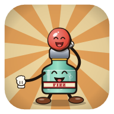
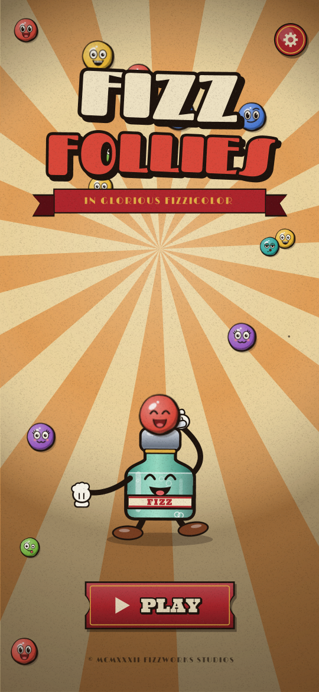
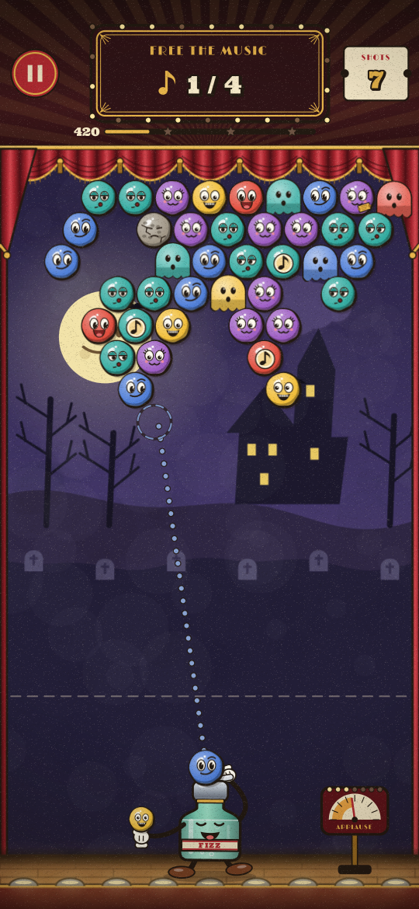
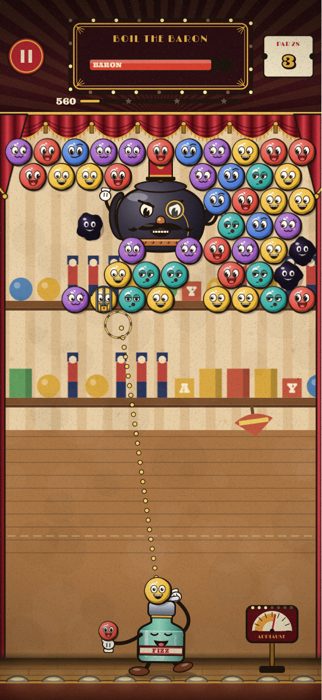
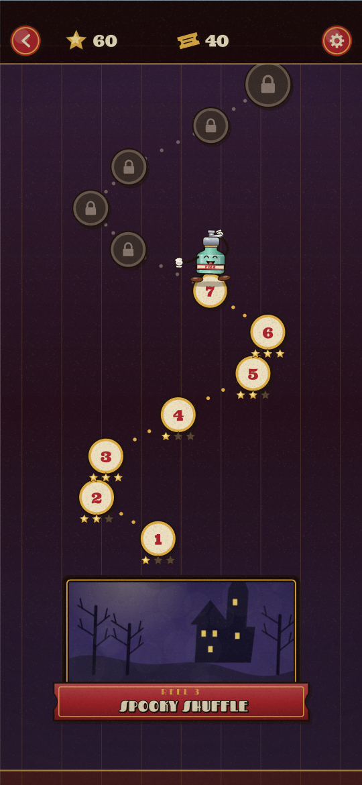

<p align="center">
  
</p>

<h1 align="center">Fizz Follies</h1>

<p align="center">
  <b>A Fizzworks Picture, in Glorious Fizzicolor.</b><br>
  A bubble shooter for Android in the style of a 1930s rubber-hose cartoon.
</p>

<p align="center">
  <a href="https://github.com/pranvirsingh/FizzFollies/releases/latest"></a>
  <a href="https://github.com/pranvirsingh/FizzFollies/actions/workflows/ci.yml"></a>
  
  
  <a href="LICENSE"></a>
</p>

<p align="center">
  
  
  
  
</p>

## About

Baron Von Boil has bottled up every note in town inside a mountain of bubbles. You play Fizz, a dancing seltzer bottle, and blast them loose one reel at a time.

Fizz Follies is written in Kotlin with **no game engine and no third-party libraries**. All the art, animation, music and sound are generated in code. The whole game is a ~570 KB APK, and the only permission it asks for is vibration.

## The show

The game has **10 reels**, each with **12 scenes**, for **120 levels** in total. Every reel has its own painted scenery and ends with a fight against the Baron.

| Reel | Name | What's new |
|---|---|---|
| 1 | Barnyard Hoedown | The basics, music notes, the Applause-O-Meter |
| 2 | Big Top Ballyhoo | Stones, bombs, the Jazz Bubble |
| 3 | Spooky Shuffle | Ghost bubbles that change colour, the Trumpet Blast |
| 4 | Sea Shanty | Caged critters; *Beat the Drop* (the ceiling lowers) |
| 5 | Toyland Two-Step | Ink blots that spread |
| 6 | Skyscraper Swing | Everything mixed, six colours |
| 7 | Moonbeam Mambo | Double-locked cages |
| 8 | Snowball Serenade | Ink, iron bars and a falling sky |
| 9 | Jungle Jamboree | Six colours, no mercy |
| 10 | The Boilerworks | The grand finale |

### Goals

- **Clear the Stage:** pop and drop the bubbles. When only three are left, they take a bow and the scene is won.
- **Free the Music:** release every bubble that holds a music note.
- **Beat the Drop:** the scenery comes down a row every few shots, so clear the stage first.
- **Boil the Baron:** the twelfth scene of every reel. Hit him directly, or pop bubbles right next to him.

### Difficulty

Difficulty climbs scene by scene within each reel. Each new reel starts a little easier than the last one ended, and brings in a new trick. Shot budgets and star scores for every level were set by a bot playing the game, then loosened on any level a so-so bot cleared less than half the time.

### Progress

- **Stars:** each level awards 1 to 3 stars.
- **Opening reels:** you need enough stars (18 more for each reel), and the previous reel's Baron must be beaten.
- **Tickets:** earned by clearing levels. Spend them on boosters (Spyglass for a full aim line, +5 shots, or starting loaded with a Firecracker) or on an Encore after losing.
- **Power shots:** big pops fill the Applause-O-Meter. When it's full, tap it for a power shot: Firecracker, Jazz Bubble or Trumpet Blast. Power shots never cost a shot.

## Controls

- Drag anywhere above Fizz to aim, and let go to fire.
- Tap Fizz to swap the loaded bubble with the one in his glove.
- Tap the Applause-O-Meter when it's full.
- Settings: sound, music, record crackle, film effects and vibration can each be switched off. Progress is saved on the device.

## The 1930s look

- **Inked art and faces:** every bubble critter is hand-inked, and each colour has its own face, so colours can be told apart without colour vision.
- **Line boil:** outlines shimmer like hand-drawn cels.
- **Rubber-hose motion:** everything bounces in time with the band.
- **Old film effects:** grain, scratches, dust, flicker, gate weave, iris wipes and silent-film title cards.
- **Theatre setting:** velvet curtains, footlights and painted scenery.
- **Music:** a synthesised hot-jazz band (tuba, banjo, brushes, clarinet, xylophone) that swells with the applause, plus optional record crackle.
- **Sound effects:** slide whistles, bonks and a sad trombone.

## Download

1. Open the [latest release](https://github.com/pranvirsingh/FizzFollies/releases/latest) and download the `.apk`.
2. Open it on your phone. Android will ask you to allow installing apps from that source the first time.
3. Requires Android 7.0 (API 24) or newer.

## Build from source

`build.sh` produces `build/FizzFollies.apk`. It needs:

- `aapt2`, `apksigner` and `d8.jar` (R8) from Android build-tools, plus `android.jar` for API 34
- the Kotlin compiler and standard library
- a JDK (for `java`, `jar` and `keytool`) and Python 3

The scripts expect the project at `/home/claude/fizz` and the toolchain in `/home/claude/tc` under specific jar names. Those paths are hardcoded in `build.sh`, `kc.sh`, `t.sh` and in many of the tests. The easiest way to build is to recreate that layout, which is what [`.github/workflows/ci.yml`](.github/workflows/ci.yml) does on Ubuntu (build-tools 34, Kotlin 2.3.10, JDK 17) before running the scripts unchanged. On first run, `build.sh` creates a local signing key, so a locally built APK is for testing. It can't update an installed release build.

## Tests

The tests run on a plain JVM against a small Java2D shim of `android.graphics`:

```
mkdir -p shots      # the screenshot tests and AudioTest write their output here
./t.sh UiShots Monkey Campaign AudioTest Report LevelSheet
```

- **UiShots:** renders 22 screens (studio card, title, map, level intro, a silent-film title card, play at six levels, pause, settings, the encore bonus, win and lose) to `shots/`, checking every sound and music call and that drawing never leaks canvas state.
- **Monkey:** 30,000 random input steps with process-death restores, checking that the score, the Applause-O-Meter, shots left and the effect pool always stay in range.
- **Campaign:** a bot plays the show from the first level through the real UI, up to 400 attempts. It fails if a level ever gets stuck, and reports DONE once it has reached the final level, or PARTIAL if it runs out of attempts first.
- **AudioTest:** checks that every sound effect is audible, and renders the menu, play and Baron music.
- **LevelSheet:** renders all 120 level layouts to one sheet.
- **Report** plays every level 6 times with a so-so bot and prints win rates and stars. It's a tuning table with no checks and takes a long time, so it isn't run in CI.

`Calibrate` and `Soften` regenerate `LevelData.kt` from bot play, and `IconGen` regenerates the launcher icons. They rewrite game files, so they are never run in CI.

## Project layout

| Path | What it is |
|---|---|
| `src/com/pranvir/fizz/Match.kt`, `Board.kt`, `Core.kt` | Match rules, the bubble board and shot tracing, shared helpers |
| `src/com/pranvir/fizz/Level.kt`, `LevelData.kt` | The 10 reels and 120 levels; per-level budgets generated by bot play |
| `src/com/pranvir/fizz/Play.kt`, `Game.kt` | The play screen, menus, map, tickets, boosters and saves |
| `src/com/pranvir/fizz/Art.kt`, `Toon.kt`, `Backdrop.kt`, `Fx.kt`, `Film.kt`, `UI.kt`, `Stage.kt` | All drawing: bubble critters, Fizz and the Baron, scenery, effects, the film layer, interface and theatre |
| `src/com/pranvir/fizz/Bot.kt`, `Rng.kt` | The aiming bot used to tune levels, and the random number generator |
| `src/com/pranvir/fizz/Synth.kt`, `Audio.kt` | The synthesised jazz band, sound effects and the mixer |
| `src/com/pranvir/fizz/MainActivity.kt` | Android entry point: view, input, haptics, storage |
| `jvmtest/` | JVM tests, tools and the `android.graphics` shim |
| `build.sh`, `kc.sh`, `t.sh`, `zipalign.py`, `rules.pro` | Build and test scripts: resources, Kotlin compile, R8, packaging, signing |

See [CHANGELOG.md](CHANGELOG.md) for release history.

## License

Code: [MIT](LICENSE) © 2026 Pranvir Singh.

Fonts:

- **Fascinate** (`assets/fonts/fascinate.ttf`) © 2011 Brian J. Bonislawsky DBA Astigmatic (AOETI), [SIL Open Font License 1.1](docs/licenses/OFL-Fascinate.txt).
- **Josefin Sans** (`assets/fonts/josefin_bold.ttf`) © 2010 The Josefin Sans Project Authors, [SIL Open Font License 1.1](docs/licenses/OFL-JosefinSans.txt).
- **Limelight** (`assets/fonts/limelight.ttf`) © Sorkin Type Co (2010 in the font file, 2011 in the published license), [SIL Open Font License 1.1](docs/licenses/OFL-Limelight.txt).
- **Ultra** (`assets/fonts/ultra.ttf`) © 2010 Brian J. Bonislawsky DBA Astigmatic (AOETI), [Apache License 2.0](docs/licenses/Apache-2.0-Ultra.txt).
